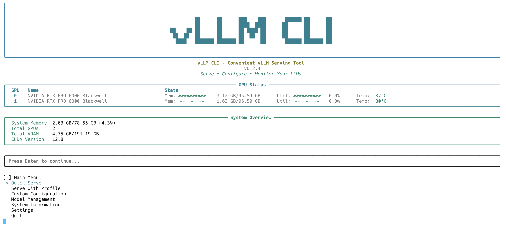

# vLLM CLI

[](https://github.com/Chen-zexi/vllm-cli/actions/workflows/ci.yml)
[](https://github.com/Chen-zexi/vllm-cli/actions/workflows/python-publish.yml)
[](https://badge.fury.io/py/vllm-cli)
[](https://opensource.org/licenses/MIT)
[](https://www.python.org/downloads/)

A command-line interface tool for serving Large Language Models using vLLM. Provides both interactive and command-line modes with features for configuration profiles, model management, and server monitoring.


*Interactive terminal interface with GPU status and system overview*

## Features

- **🎯 Interactive Mode** - Rich terminal interface with menu-driven navigation
- **⚡ Command-Line Mode** - Direct CLI commands for automation and scripting
- **🤖 Model Management** - Automatic discovery of local models with HuggingFace and Ollama support
- **🔧 Configuration Profiles** - Pre-configured and custom server profiles for different use cases
- **📊 Server Monitoring** - Real-time monitoring of active vLLM servers
- **🖥️ System Information** - GPU, memory, and CUDA compatibility checking
- **📝 Advanced Configuration** - Full control over vLLM parameters with validation

**Quick Links:** [📖 Docs](#documentation) | [🚀 Quick Start](#quick-start) | [📸 Screenshots](docs/screenshots.md) | [📘 Usage Guide](docs/usage-guide.md) | [❓ Troubleshooting](docs/troubleshooting.md) | [🗺️ Roadmap](docs/roadmap.md)

## What's New in v0.2.4

### 🚀 Hardware-Optimized Profiles for GPT-OSS Models
New built-in profiles specifically optimized for serving GPT-OSS models on different GPU architectures:
- **`gpt_oss_ampere`** - Optimized for NVIDIA A100 GPUs
- **`gpt_oss_hopper`** - Optimized for NVIDIA H100/H200 GPUs
- **`gpt_oss_blackwell`** - Optimized for NVIDIA Blackwell GPUs

Based on official [vLLM GPT recipes](https://docs.vllm.ai/projects/recipes/en/latest/OpenAI/GPT-OSS.html) for maximum performance.

### ⚡ Shortcuts System
Save and quickly launch your favorite model + profile combinations:
```bash
vllm-cli serve --shortcut my-gpt-server
```

### 🦙 Full Ollama Integration
- Automatic discovery of Ollama models
- GGUF format support (experimental)
- System and user directory scanning

### 🔧 Enhanced Configuration
- **Environment Variables** - Universal and profile-specific environment variable management
- **GPU Selection** - Choose specific GPUs for model serving (`--device 0,1`)
- **Enhanced System Info** - vLLM feature detection with attention backend availability

See [CHANGELOG.md](CHANGELOG.md) for detailed release notes.

## Quick Start

### Installation

```bash
# Install from PyPI
# Make sure you activate the environment you have vllm installed in
pip install --upgrade vllm-cli

# Or build from source
git clone https://github.com/Chen-zexi/vllm-cli.git
cd vllm-cli
pip install -e .
```

### Prerequisites
- Python 3.9+
- CUDA-compatible GPU (recommended)
- vLLM package installed

### Basic Usage

```bash
# Interactive mode - menu-driven interface
vllm-cli

# Serve a model
vllm-cli serve facebook/opt-125m

# Use a shortcut
vllm-cli serve --shortcut my-model
```

For detailed usage instructions, see the [📘 Usage Guide](docs/usage-guide.md).

## Configuration

### Built-in Profiles

vLLM CLI includes 7 optimized profiles for different use cases:

**General Purpose:**
- `standard` - Minimal configuration with smart defaults
- `high_throughput` - Maximum performance configuration
- `low_memory` - Memory-constrained environments
- `moe_optimized` - Optimized for Mixture of Experts models

**Hardware-Specific (GPT-OSS):**
- `gpt_oss_ampere` - NVIDIA A100 GPUs
- `gpt_oss_hopper` - NVIDIA H100/H200 GPUs
- `gpt_oss_blackwell` - NVIDIA Blackwell GPUs

See [**📋 Profiles Guide**](docs/profiles.md) for detailed information.

### Configuration Files
- **Main Config**: `~/.config/vllm-cli/config.yaml`
- **User Profiles**: `~/.config/vllm-cli/user_profiles.json`
- **Shortcuts**: `~/.config/vllm-cli/shortcuts.json`


## Documentation

- [**📘 Usage Guide**](docs/usage-guide.md) - Complete usage instructions
- [**📋 Profiles Guide**](docs/profiles.md) - Built-in profiles details
- [**❓ Troubleshooting**](docs/troubleshooting.md) - Common issues and solutions
- [**📸 Screenshots**](docs/screenshots.md) - Visual feature overview
- [**🔍 Model Discovery**](docs/MODEL_DISCOVERY_QUICK_REF.md) - Model management guide
- [**🦙 Ollama Integration**](docs/ollama-integration.md) - Using Ollama models
- [**⚙️ Custom Models**](docs/custom-model-serving.md) - Serving custom models
- [**🗺️ Roadmap**](docs/roadmap.md) - Future development plans

## Integration with hf-model-tool

vLLM CLI uses [hf-model-tool](https://github.com/Chen-zexi/hf-model-tool) for model discovery:
- Comprehensive model scanning
- Ollama model support
- Shared configuration

## Development

### Project Structure
```
src/vllm_cli/
├── cli/           # CLI command handling
├── config/        # Configuration management
├── models/        # Model management
├── server/        # Server lifecycle
├── ui/            # Terminal interface
└── schemas/       # JSON schemas
```

### Contributing
Contributions are welcome! Please feel free to open an issue or submit a pull request.

## License

MIT License - see [LICENSE](LICENSE) file for details.
