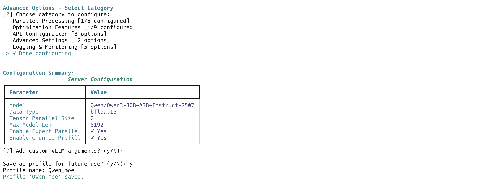

# vLLM CLI Screenshots

Visual guide to vLLM CLI's features and interfaces.

## Model Management

### LoRA Adapter Support

*Serve models with LoRA adapters - select base model and multiple LoRA adapters for serving*

### Enhanced Model List Display

*Comprehensive model listing showing HuggingFace models, LoRA adapters, and datasets with size information*

### Model Directory Management

*Configure and manage custom model directories for automatic model discovery*

### Model Selection with Remote Support

*Model selection interface showing both local models and HuggingFace Hub auto-download option*

## Configuration

### Quick Serve with Last Configuration

*Quick serve feature automatically uses the last successful configuration and saved shortcuts*

### Custom Configuration Example

*Advanced configuration interface with categorized vLLM options and custom arguments*

## Server Management

### Server Monitoring

*Real-time server monitoring showing GPU utilization, server status, and streaming logs*

### Error Handling and Log Viewing

*Interactive error recovery with log viewing options when server startup fails*

## System Information

### System Information Display

*Comprehensive system information display showing GPU capabilities, memory, dependencies version, attention backends, and quantization support*
